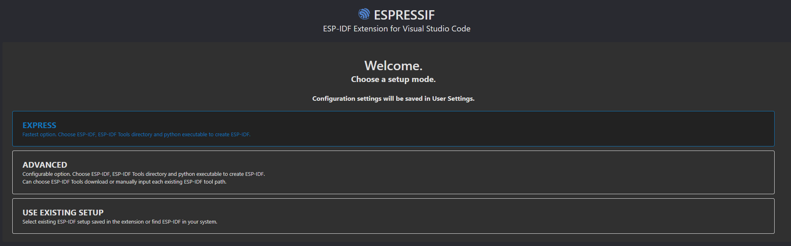

# olfactory-ble-controller

### How To Flash
1. Install VS Code.
2. Install the [ESP-IDF Extension](https://marketplace.visualstudio.com/items?itemName=espressif.esp-idf-extension).
    1. Click EXPRESS when you configure the extension. 
    2. For the selected ESP-IDF version, select the release version unless you already have it downloaded in your system.
    3. Click install (this will take a little).
3. 